# Workflow of Tasks

## 1. Workflow Overview
### 1.1 Workflow Goal
This workflow supports the system goal defined in `my_first_agent/README.md`.

### 1.2 Workflow Trigger

The workflow will start when a potential attendees registers for the Hackathon.

### 1.3 Completion Condition at Runtime

The system knows that the workflow is completed when it has generated a probability of the registrants attendance.

### 1.4 General Workflow

The normal path without exception paths and human-review points starts with the registrant filling out the registration form and including information such as name, contact info, reason for registering, and overall understanding of AI. The system will then take the information and determine the probability of the registrant attending based on the details. There will be three data points to generate a probability. The first being if they have gone to a club meeting or if they are a member based on their name and contact info. The second data point will be the reason for registering; if the reason seems well thought they will be calculated as more likely to go. The final data point is their understanding of AI. While a lower understanding shouldn't decrease their probability, a higher understanding should increase their probability. The system will then generate a probability for the registrant to attend.

Some exceptions are if the registrant is in a board position for the club as they are highly likely to attend and are in direct conversation with organizers. Human-review points would be if the contact info and name aren't in Cal Poly's data base, the human reviewer should reach out and confirm if the student is a Cal Poly student and update their information accordingly. Another human-review point would be if the registrants reason for attending is not relevant to the Hackathon. The human reviewer would then use their best judgement to assign a probability based on their response.

### 1.5 Workflow Diagram

```mermaid
flowchart TD
T1["T1: Receive registration"] --> T2["T2: Capture permitted details"]
T2 --> D1{"D1: Was registration canceled?"}

D1 -->|Yes| C2([C2: Exclude canceled registration])
D1 -->|No| T3["T3: Validate eligibility record"]

T3 --> D2{"D2: Is eligibility verifiable?"}
D2 -->|Yes| T4["T4: Check prior engagement"]
D2 -->|No| H1["H1: Review eligibility record"]

H1 --> D3{"D3: Can reviewer verify eligibility?"}
D3 -->|Yes| T4
D3 -->|No| C3([C3: Hold registration from forecast])

T4 --> D4{"D4: Is prior engagement available?"}
D4 -->|Yes| T5["T5: Apply engagement signal"]
D4 -->|No| T6["T6: Apply neutral engagement signal"]

T5 --> D5{"D5: Is registrant a board member?"}
T6 --> D5

D5 -->|Yes| T7["T7: Apply board-attendance signal"]
D5 -->|No| T8["T8: Score registration reason"]

T8 --> D6{"D6: Is reason relevant and clear?"}
D6 -->|Yes| T9["T9: Score AI understanding"]
D6 -->|No| H2["H2: Review registration reason"]

H2 --> D7{"D7: Can reviewer assess intent?"}
D7 -->|Yes| T10["T10: Assign reviewed reason signal"]
D7 -->|No| T11["T11: Assign neutral reason signal"]

T10 --> T9
T11 --> T9
T7 --> T12["T12: Calculate attendance probability"]
T9 --> T12

T12 --> D8{"D8: Is probability uncertain?"}
D8 -->|No| T16["T16: Aggregate privacy-safe forecast"]
D8 -->|Yes| T13["T13: Send one voluntary confirmation request"]

T13 --> T14["T14: Wait for response"]
T14 --> D9{"D9: Has response arrived?"}

D9 -->|Yes| T15["T15: Update attendance probability"]
D9 -->|No| D10{"D10: Has confirmation cutoff passed?"}

D10 -->|No| T14
D10 -->|Yes| T17["T17: Keep prior probability"]

T15 --> T16
T17 --> T16

T16 --> T18["T18: Recommend supplies and swag"]
T18 --> C1([C1: Forecast completed])
```

